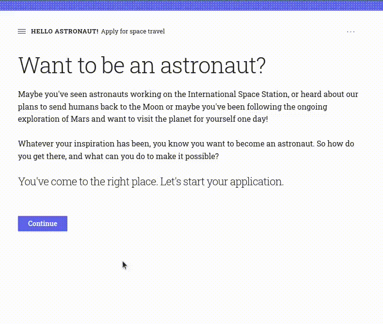

# Nitro

Create apps 10x quicker, without Javascript, HTML, or CSS.


**Currently a Work in Progress.**
Follow [the development blog](https://wrong.technology/tags/nitro/) or
[@CrunchingData](https://twitter.com/CrunchingData) for updates, or use
[Discord](https://discord.gg/6RUdk2CPgw) or
[Discussions](https://github.com/h2oai/nitro/discussions) for help / ideas / suggestions.

## Get started

- **[Install](https://nitro.h2o.ai/install/)**
- **Learn**:
  [Introduction](https://nitro.h2o.ai/intro/)
  | [Guide](https://nitro.h2o.ai/guide/basics/)
  | [Gallery](https://nitro.h2o.ai/gallery/)
  | [Plugins](https://nitro.h2o.ai/plugins/)
  | [Cheatsheet](https://nitro.h2o.ai/cheatsheet/)
- **More**:
  [Roadmap](https://github.com/h2oai/nitro/issues/4)
  | [Milestones](https://github.com/h2oai/nitro/milestones)
  | [Backlog](https://github.com/h2oai/nitro/issues/15)
  | [Change Log](https://nitro.h2o.ai/change-log/)


## Philosophy

Recall how simple it is to author interactive command line applications using Python's built-in `input()` and `print()`:

```py
def main():
    name = input('What is your name?')
    feel = input(f'How do you feel today, {name}?')
    print(f'What a coincidence, {name}, I feel {feel}, too!')
```

```
> What is your name?
> Boaty McBoatface
> How do you feel today, Boaty McBoatface?
> intrigued
> What a coincidence, Boaty McBoatface, I feel intrigued, too!
```

Nitro brings that same level of simplicity to authoring web applications:

```py
from h2o_nitro import View, box

def main(view: View):
    name = view(box('What is your name?', value='Boaty McBoatface'))
    feel = view(box(f'How do you feel today, {name}?', value='intrigued'))
    view(f'What a coincidence, {name}, I feel {feel}, too!')
```


And here's a more elaborate example with seven pages in [seven Python statements](https://github.com/h2oai/nitro/blob/main/py/examples/space_flight.py):


