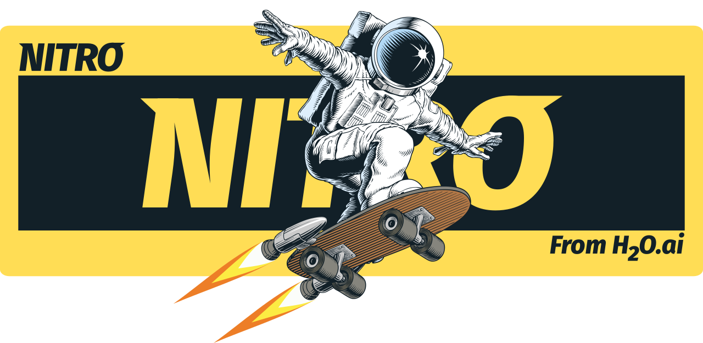
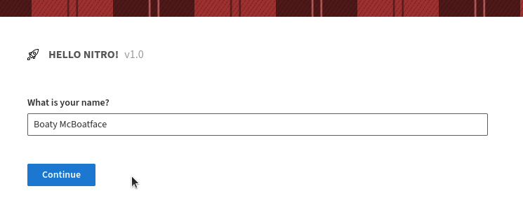

# Nitro

Nitro (N<sub>2</sub>O) is the simplest way to build web apps using Python. No front-end experience required.



## Philosophy

Recall how simple it is to author interactive command line applications using Python's built-in `input()` and `print()`:

```py
def main():
    name = input('What is your name?')
    feel = input(f'How do you feel today, {name}?')
    print(f'What a coincidence, {name}, I feel {feel}, too!')
```

```
> What is your name?
> Boaty McBoatface
> How do you feel today, Boaty McBoatface?
> intrigued
> What a coincidence, Boaty McBoatface, I feel intrigued, too!
```

Nitro brings that same level of simplicity to authoring web applications:

```py
from h2o_nitro import View, box

def main(view: View):
    name = view(box('What is your name?', value='Boaty McBoatface'))
    feel = view(box(f'How do you feel today, {name}?', value='intrigued'))
    view(f'What a coincidence, {name}, I feel {feel}, too!')
```



And here's a more elaborate example with seven pages in [seven Python statements](https://github.com/h2oai/nitro/blob/main/py/examples/space_flight.py):


## Vision

**One language, one codebase, multiple screens.** 
  - Write your app in Python, R, Julia, or Go. 
  - Access it from six different platforms: web, iOS, Android, Linux, macOS, and Windows.

## Status

**H2O Nitro is experimental software. API is subject to change. Do not use in production.**

Critical missing features include data visualization, back-button (history) support, internationalization and localization.

The API is mostly stable, but expect minor changes while we ship support for at least one other 
language (R, Julia, Go, Typescript, C#, Java planned), and compile apps to mobile or desktop.

## Features

- **No HTML/Javascript.** Build sophisticated multi-page wizard-like workflows and walkthroughs using pure Python.
- **Less Code.** Laser-focused on keeping application code simple, concise, and clear.
    - **Simplicity.** Page flow follows code flow.
    - **Conciseness.** Lowest number of lines of code for expressing solutions to a given problem.
    - **Clarity.** Write apps without jumping through callbacks, request handlers, or event handlers.
- **Minimal API.** Only three functions: `view()`, `box()`, `option()`, and optionally `row()` and `column()` for
  layout.
- **Batteries-included.** Huge library of sophisticated, accessibility-friendly widgets and data visualizations.
- **Library.** Nitro is a library, not a server. Integrates with [Django](https://www.djangoproject.com/)
  , [Flask](https://flask.palletsprojects.com/), [Starlette](https://www.starlette.io/)
  , [Tornado](https://www.tornadoweb.org/), [Uvicorn](https://www.uvicorn.org/) and other popular frameworks. Can be
  integrated into your existing applications.
- **Prototyping-to-production.** Carefully designed API to rapidly prototype new ideas, then progressively improve
  presentation and aesthetics over time without affecting initial implementation simplicity, or sacrificing control.
- **Unix philosophy.** Tries to do one thing and do it well: display interactive user interfaces. Bring your own web
  app/server of choice and follow its recommendations for hosting, deployment, security, monitoring, metrics and data
  management.
- **Extensively documented.** Run `nitro docs` to access interactive docs and 150+ live examples.

## Differences from H<sub>2</sub>O Wave

**TL;DR:** Use [Wave](https://wave.h2o.ai/) for building visualization-heavy analytical dashboards. For everything else,
use Nitro.

- **Deployment.** Nitro is a library, not a server. It's a heavily stripped-down version of [Wave](https://wave.h2o.ai/)
  with a different, simpler API, designed for integration with existing frameworks, and cross-compiling for mobile and
  desktop apps.
- **Content Management.** Wave is capable of storing and broadcasting content and data, making it simple to build
  dashboards without having to deal with data management. Nitro has no such features.
- **API.** Wave's API is *dashboard-oriented*, and has several features that make it easy to develop and deploy
  real-time analytics and dashboards easily. Nitro's API is *page-flow-oriented*, and makes it radically simple to
  author sophisticated workflows and wizards without dealing with callback functions and request handlers.
